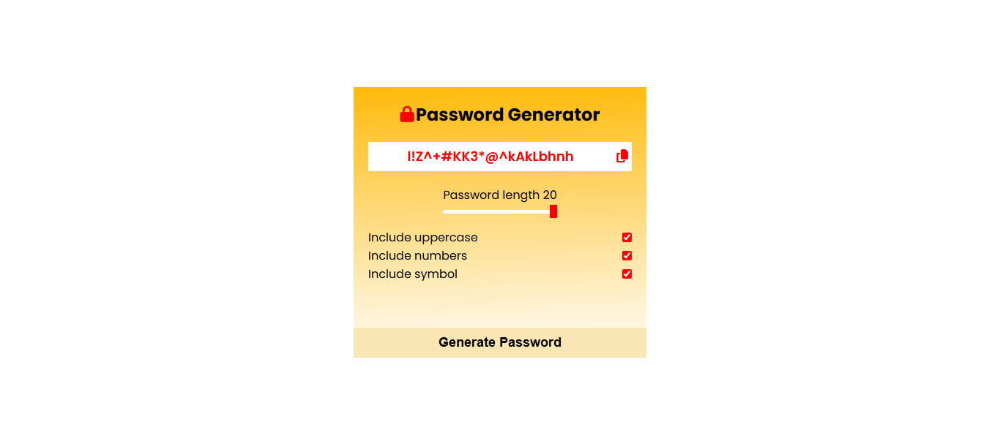

# 🔐 Password Generator

A lightweight and user-friendly password generator that lets you create secure passwords based on selected criteria such as length, numbers, symbols, and letter case.

 

## 🚀 Features
- Choose password length
- Include/exclude:
  - Uppercase letters
  - Lowercase letters
  - Numbers
  - Symbols
- One-click password copy
- Toaster alert for copy confirmation
- Responsive and modern design

 

## 🛠️ Built With
- HTML
- CSS
- JavaScript

 

## 📷 Screenshot

 

## 📄 License
This project is licensed under the MIT License – see the [LICENSE](LICENSE) file for details.
